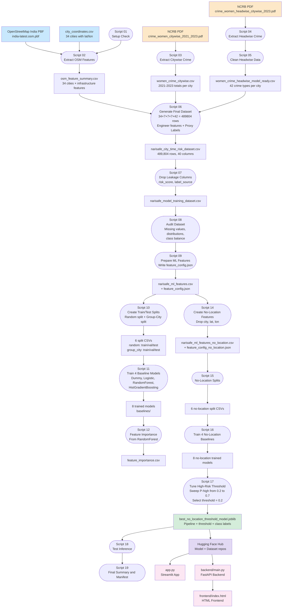
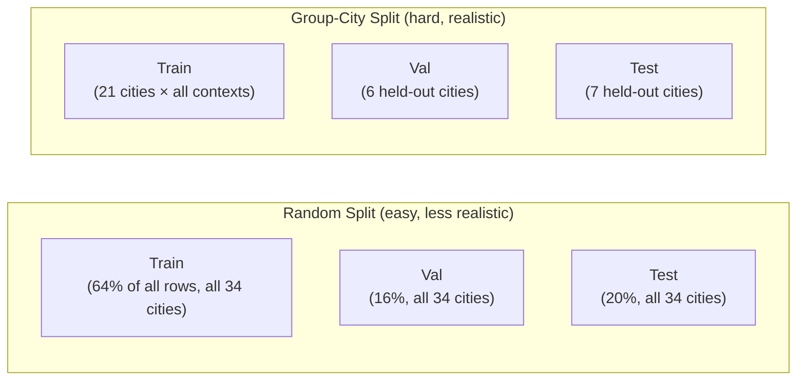
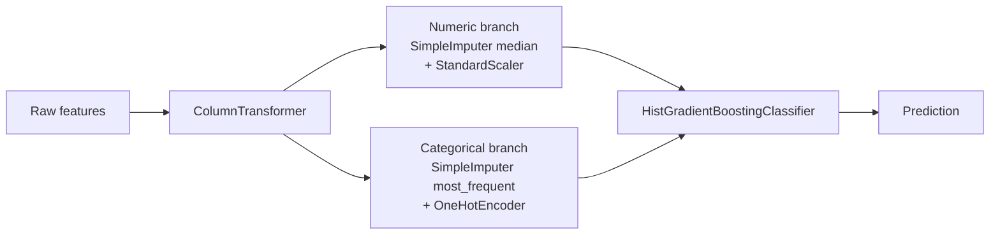

# NariSafe — Women Safety Risk Awareness for Indian Cities

**Live Demo:** [narisafe-risk-awareness.streamlit.app](https://narisafe-risk-awareness.streamlit.app)

NariSafe is a women's safety risk-awareness prototype built entirely on public data — NCRB crime statistics from 2021–2023 and OpenStreetMap urban infrastructure data. It covers **34 Indian cities** and classifies any given situation (city + time + area type + complaint type) into a risk-awareness level: **low**, **medium**, or **high**.

This is not a guaranteed crime prediction system. It is a data-informed awareness tool for contextual understanding.

> **Disclaimer:** Risk scores are derived from NCRB 2021–2023 statistics and OpenStreetMap data using rule-based proxy labels. Use this as an awareness tool only — not as a substitute for official safety advisories or emergency services.

---

## Table of Contents

- [What does NariSafe do?](#what-does-narisafe-do)
- [Live Demo](#live-demo)
- [How it works — Quick Overview](#how-it-works--quick-overview)
- [Full Pipeline Diagram](#full-pipeline-diagram)
- [Data Sources](#data-sources)
- [Script-by-Script Walkthrough](#script-by-script-walkthrough)
- [Features Explained](#features-explained)
- [ML Concepts Explained in Detail](#ml-concepts-explained-in-detail)
- [Model Results](#model-results)
- [Running Locally](#running-locally)
- [Download Dataset and Model from Hugging Face](#download-dataset-and-model-from-hugging-face)
- [Rebuild the Dataset from Scratch](#rebuild-the-dataset-from-scratch)
- [API Reference](#api-reference)
- [Project Structure](#project-structure)
- [What is Tracked in Git](#what-is-tracked-in-git)
- [Tech Stack](#tech-stack)
- [Limitations and Disclaimer](#limitations-and-disclaimer)
- [License](#license)

---

## What does NariSafe do?

You pick a context — a city, a day of the week, an hour, an area type, and a type of complaint — and NariSafe tells you the contextual risk-awareness level for that situation. It also shows you *why*: what factors are contributing to that risk, what factors are helping, and what the data limitations are.

```
User selects:
  City         → e.g. Gwalior
  Day          → e.g. Saturday
  Hour         → e.g. 11:00 PM
  Area type    → e.g. transit
  Complaint    → e.g. assault_women_18_and_above

          ↓

Backend looks up the pre-built feature row
(city-level crime stats + OSM infrastructure + time + area features)

          ↓

No-location model predicts:
  P(low), P(medium), P(high)

  If P(high) >= 0.2  →  Risk level = "high"
  Otherwise          →  Whichever of low/medium has higher probability

          ↓

Response shows:
  Risk level, model confidence, key risk factors,
  mitigating factors, infrastructure context, data limitations
```

---

## Live Demo

The easiest way to try NariSafe is the hosted Streamlit app. No installation required.

**[narisafe-risk-awareness.streamlit.app](https://narisafe-risk-awareness.streamlit.app)**

The app downloads the trained model and dataset from Hugging Face automatically when it loads.

---

## How it works — Quick Overview

The full system is built in three stages:

1. **Data Collection** — NCRB PDFs for crime statistics, OpenStreetMap for infrastructure
2. **Dataset Building** — 489,804 rows generated by cross-joining 34 cities × 7 days × 7 hours × 7 area types × 42 complaint types, then engineered features and proxy risk labels are attached
3. **ML Pipeline** — four baseline models trained and compared, no-location model selected, high-risk threshold tuned, final model bundled and published to Hugging Face

---

## Full Pipeline Diagram



---

## Data Sources

### 1. NCRB PDF Reports

Two PDFs are placed manually in `data/raw/` before running the pipeline. These are official National Crime Records Bureau publications available for free on the NCRB website.

| File | What it contains |
|---|---|
| `crime_women_citywise_2021_2023.pdf` | Table 3B.1 — total women crimes per city for 2021, 2022, 2023 |
| `crime_women_headwise_citywise_2023.pdf` | Breakdown by crime type (head-wise) per city for 2023 |

These PDFs are parsed with `pdfplumber`, which reads text from PDF tables and converts them into structured rows.

### 2. OpenStreetMap India PBF

File: `data/raw/india-latest.osm.pbf`

This is a full binary dump of all OpenStreetMap data for India. It is downloaded from [Geofabrik](https://download.geofabrik.de/asia/india.html) and is approximately 1.6 GB. It is **not tracked in git** because of its size — you download it yourself if you want to rebuild from scratch.

`pyrosm` reads the PBF and extracts infrastructure features for each city within defined circular buffers:

| Feature | Buffer radius |
|---|---|
| Police stations | 5 km |
| Public transport stops | 3 km |
| Street lights | 2 km |
| Road network length | 5 km |
| Land use polygons | 5 km |
| Education POIs | 5 km |

### 3. City Coordinates

File: `data/raw/city_coordinates.csv`

Hand-verified latitude and longitude for the 34 city centers. Used as anchor points for the OSM radius queries. This file is in `data/raw/` which is gitignored, but it is small enough to recreate manually if needed.

**34 cities covered:**

```
Agra, Amritsar, Asansol, Aurangabad, Bhopal, Chandigarh City,
Dhanbad, Durg-Bhilainagar, Faridabad, Gwalior, Jabalpur, Jamshedpur,
Jodhpur, Kannur, Kollam, Kota, Ludhiana, Madurai, Malappuram, Meerut,
Nasik, Prayagraj, Raipur, Rajkot, Ranchi, Srinagar,
Thiruvananthapuram, Thrissur, Tiruchirapalli, Vadodara, Varanasi,
Vasai Virar, Vijayawada, Vishakhapatnam
```

---

## Script-by-Script Walkthrough

The pipeline has 19 numbered scripts that run sequentially. Here is a detailed explanation of what each one does, including the ML and data engineering concepts involved.

---

### Script 01 — `01_check_osm_setup.py`

**What it does:** A preflight check before starting the heavy extraction. It verifies that:
- `india-latest.osm.pbf` exists in `data/raw/` and shows its size
- `city_coordinates.csv` exists and previews the first few rows
- All required Python packages (`pandas`, `numpy`, `geopandas`, `shapely`, `pyproj`, `pyrosm`) are importable

If anything is missing, it prints what to install and exits. This saves you from discovering a missing file only after 30 minutes of extraction.

---

### Script 02 — `02_extract_osm_features.py`

**What it does:** Reads the 1.6 GB OSM PBF file and extracts infrastructure counts for every city. This is the slowest script — it can take 30 to 90 minutes depending on your machine.

**How it works:**

For each city:
1. Crops a bounding box from the full India PBF using `pyrosm` — approximately ±0.15 degrees around the city center (roughly a 16 km box)
2. Reprojects coordinates from GPS (EPSG:4326) to a local UTM projection so that buffer distances are in real meters, not degrees
3. Draws circular buffers of different radii around the city center using `shapely`
4. Counts all OSM features that fall inside each buffer

**Why UTM projection?** Geographic coordinates (latitude/longitude) are not flat — one degree of latitude is not the same as one degree of longitude, and neither is a constant number of kilometers. UTM (Universal Transverse Mercator) projects the earth onto a flat plane within a local zone, so you can correctly measure distances in meters. The script picks the right UTM zone automatically based on the city's longitude.

**Features extracted per city:**

| Feature | Radius | OSM tag used |
|---|---|---|
| `police_station_count_5km` | 5 km | `amenity=police` |
| `nearest_police_station_km` | — | distance to nearest |
| `bus_stop_count_3km` | 3 km | `highway=bus_stop` |
| `bus_station_count_3km` | 3 km | `amenity=bus_station` |
| `railway_station_count_3km` | 3 km | `railway=station/halt` |
| `public_transport_count_3km` | 3 km | all above combined |
| `street_light_count_2km` | 2 km | `highway=street_lamp` |
| `road_length_km_5km` | 5 km | all road types |
| `road_density_km_per_sqkm_5km` | 5 km | derived from length |
| `commercial_landuse_count_5km` | 5 km | `landuse=commercial` |
| `residential_landuse_count_5km` | 5 km | `landuse=residential` |
| `industrial_landuse_count_5km` | 5 km | `landuse=industrial` |
| `retail_landuse_count_5km` | 5 km | `landuse=retail` |
| `education_poi_count_5km` | 5 km | `amenity=school/college/university` |

**Crash recovery:** After each city is processed, the script immediately saves progress to `data/intermediate/osm_feature_summary.csv`. If the script crashes or is interrupted, it resumes from where it left off instead of starting over.

**Output:** `data/intermediate/osm_feature_summary.csv` (34 rows, one per city)

---

### Script 03 — `03_extract_citywise_women_crime.py`

**What it does:** Parses the first NCRB PDF to extract the total number of women crimes per city for 2021, 2022, and 2023. Uses `pdfplumber` to read table cells from the PDF.

**Output:** `data/intermediate/women_crime_citywise.csv`

Columns: `city`, `women_crime_2021`, `women_crime_2022`, `women_crime_2023`, `population_lakhs`, `women_crime_rate_2023`, `chargesheeting_rate_2023`

---

### Script 04 — `04_extract_all_headwise_women_crime.py`

**What it does:** Parses the second NCRB PDF, which breaks down crimes by category ("heads" in NCRB terminology). This gives you, for each city, how many cases of each specific crime type occurred in 2023.

The raw PDF contains 54 categories before cleanup — including subtotals and total rows that need to be removed.

**Output:** `data/intermediate/women_crime_headwise_all_types.csv`

---

### Script 05 — `05_clean_headwise_for_model.py`

**What it does:** Cleans the raw headwise data from Script 04.

- Removes subtotal rows and total rows (which would create data leakage if used as features)
- Normalizes all crime type names to `snake_case` for consistency (e.g. "Rape (Women 18 Yrs. & Above)" → `rape_women_18_and_above`)
- Keeps 42 atomic complaint types that are meaningful for the model

**Output:** `data/intermediate/women_crime_headwise_model_ready.csv`

---

### Script 06 — `06_generate_final_dataset.py`

**What it does:** This is the core dataset generation script. It takes all three intermediate files and generates the full 489,804-row dataset.

**Step 1 — Cross-join all dimensions:**

```python
cities       = 34
days         = 7  (Monday – Sunday)
hours        = 7  (6, 9, 12, 15, 18, 21, 23)
area_contexts = 7  (residential, commercial, market, industrial,
                    transit, educational, mixed)
complaint_types = 42

Total = 34 × 7 × 7 × 7 × 42 = 489,804 rows
```

Each row represents one scenario: a specific city, on a specific day, at a specific hour, in a specific area type, for a specific complaint type.

**Step 2 — Attach data from intermediate files:**

Each row gets:
- The matching headwise crime count and share for that city and complaint type (from Script 05)
- The city-level crime statistics for 2021–2023 (from Script 03)
- The OSM infrastructure counts for that city (from Script 02)

**Step 3 — Feature engineering:**

Several new features are computed from existing columns:

- `is_weekend` — 1 if Saturday or Sunday, else 0
- `time_bucket` — groups the hour into morning (6–11), afternoon (12–16), evening (17–21), late_night (22+)
- `lighting_score` — a 1–5 score computed from street light count, area type, and time. A zero street light count is treated as unknown (score = 3), not as "actually dark", because OSM street light data is very sparse for most Indian cities.
- `crowd_density` — low / medium / high, derived from area type and hour. For example: a market at 3pm is high crowd; an industrial area at 11pm is low crowd.
- `police_access_score` — 0–3, from nearest police station distance: ≤1 km = 3, ≤3 km = 2, ≤5 km = 1, >5 km = 0
- `transport_access_score` — 0–3, from total public transport count within 3 km
- `urban_density_score` — 0–3, from road density
- `complaint_severity` — 1, 2, or 3 — manually assigned based on crime type (see mapping in the script)

**Step 4 — Compute the proxy risk label:**

There is no real incident-level ground truth. Instead, a `risk_score` is computed as a weighted sum of available features, then converted to `risk_level`:

```
risk_score =
    + crime rate component       (0–3 points based on city's women crime rate)
    + crime growth component     (+1 if growth > 10% since 2021)
    + complaint share component  (0–3 based on how common this crime type is in city)
    + complaint severity         (1–3)
    + time of day                (+2 for late night, +1 for evening)
    + area×time interaction      (+2 if industrial/transit at night; +1 if market at evening)
    + lighting penalty           (+2 if poorly lit; +1 if moderate)
    + crowd density              (+2 if low crowd; +1 if medium crowd)
    + police access              (+2 if no stations nearby; +1 if limited)
    + transport access           (+2 if no transport; +1 if limited)

risk_level:
    score ≤ 6   → low
    score 7–12  → medium
    score ≥ 13  → high
```

**Output:** `data/processed/narisafe_city_time_risk_dataset.csv` (489,804 rows, 40 columns)

---

### Script 07 — `07_create_model_training_dataset.py`

**What it does:** Drops columns that must not be used as model input features.

**Why?** `risk_score` was used to *create* `risk_level`. If `risk_score` were included as a model input, the model would simply learn "high risk_score → high risk_level" and get perfect accuracy — without learning anything useful. This is called **target leakage** (explained in detail in the ML concepts section below).

Dropped columns: `risk_score`, `complaint_type_original`, `label_source`

**Output:** `data/processed/narisafe_model_training_dataset.csv`

---

### Script 08 — `08_audit_training_dataset.py`

**What it does:** Audits the training dataset before any ML is done. Checks for:

- Missing values in each column
- Data type consistency
- Class balance — how many rows are low, medium, high
- Numeric distributions (min, max, mean, percentiles)
- Categorical value counts

This step is important because ML models can behave unexpectedly when data has unexpected distributions or many missing values.

**Output:** Three CSV files in `data/processed/audit/` (gitignored — generated locally)

---

### Script 09 — `09_prepare_ml_features.py`

**What it does:** Writes the `feature_config.json` file, which tells the training scripts which columns are numeric features and which are categorical features.

**Why separate numeric and categorical?** ML models like Logistic Regression and HistGradientBoosting do not know what to do with text values like `"residential"` or `"Monday"`. They expect numbers. Categorical features need to be encoded — most commonly with one-hot encoding, which creates one binary column per possible value.

The feature config also records which column is the target (`risk_level`).

**Output:**
- `data/processed/ml_ready/feature_config.json` (tracked in git)
- `data/processed/ml_ready/narisafe_ml_features.csv` (gitignored — download from HF)

---

### Script 10 — `10_create_train_test_splits.py`

**What it does:** Creates two different types of train/validation/test splits from the dataset.

**Split type 1 — Random split (64/16/20):**

Rows are shuffled randomly and divided 64% train, 16% validation, 20% test. The split is *stratified*, meaning each split maintains the same class proportions as the full dataset.

**Split type 2 — Group-city split:**

Entire cities are held out for validation and test — no row from a validation or test city appears in training.

```
Train cities  (21):  Amritsar, Asansol, Aurangabad, Bhopal, Chandigarh City,
                     Dhanbad, Durg-Bhilainagar, Jamshedpur, Kannur, Ludhiana,
                     Madurai, Malappuram, Nasik, Raipur, Rajkot, Srinagar,
                     Vadodara, Varanasi, Vasai Virar, Vijayawada, Vishakhapatnam

Val cities    (6):   Agra, Gwalior, Jabalpur, Jodhpur, Kollam, Tiruchirapalli

Test cities   (7):   Faridabad, Kota, Meerut, Prayagraj, Ranchi,
                     Thiruvananthapuram, Thrissur
```

The group-city split is the more honest evaluation because it tests whether the model can generalize to cities it has never seen. The random split is easier but less realistic — the model has seen rows from every city during training, so it is essentially memorizing patterns per city.

This distinction is explained more in the ML concepts section.

**Output:** 6 CSV files in `data/processed/ml_ready/splits/` (gitignored — generated locally)

---

### Script 11 — `11_train_baseline_models.py`

**What it does:** Trains four baseline models on both split types (random and group-city), for a total of 8 trained models.

**Preprocessing pipeline (same for all models):**

```
ColumnTransformer
  ├── Numeric features:
  │     SimpleImputer (strategy=median)  →  fills missing values with median
  │     StandardScaler                  →  centers and scales to unit variance
  └── Categorical features:
        SimpleImputer (strategy=most_frequent)  →  fills missing values
        OneHotEncoder (handle_unknown=ignore)   →  converts text to binary columns
```

**Four models compared:**

| Model | Description |
|---|---|
| `DummyClassifier` | Always predicts the most frequent class (medium). A sanity-check baseline. If your real model doesn't beat this, something is wrong. |
| `LogisticRegression` | A linear model. Fits a hyperplane through the feature space. Interpretable, but limited in capturing non-linear patterns. |
| `RandomForestClassifier` | An ensemble of decision trees. Each tree is trained on a random subset of data and features. The final prediction is a majority vote. |
| `HistGradientBoostingClassifier` | Gradient boosting with histogram-based splitting (like LightGBM). Trains trees sequentially where each tree corrects the errors of the previous one. |

Each model is evaluated on both validation and test sets using accuracy, macro F1, and weighted F1.

**Output:**
- 8 joblib model files in `models/baselines/` (gitignored)
- `reports/ml/baseline_model_report.md` (gitignored — generated)
- `reports/ml/baseline_model_summary.csv` (gitignored — generated)

---

### Script 12 — `12_feature_importance.py`

**What it does:** Extracts and ranks features by importance from the best baseline model (RandomForest, since it has a `feature_importances_` attribute).

Feature importance in a Random Forest measures how much each feature reduces prediction error on average across all trees. Higher importance = the model relied on that feature more heavily.

**Output:**
- `reports/ml/feature_importance.csv` (tracked in git)
- `reports/ml/feature_importance_report.md` (gitignored — generated)

---

### Script 13 — `13_predict_risk.py`

**What it does:** A standalone prediction test using the with-location baseline model. This script exists for reference — it is not part of the main inference path used by the app.

---

### Script 14 — `14_create_no_location_features.py`

**What it does:** Creates a new version of the feature dataset with `city`, `latitude`, and `longitude` removed.

**Why remove location features?**

When city identity is included as a model feature, the model can simply learn "Gwalior = high risk" and memorize patterns per city. It doesn't need to understand *why* Gwalior has higher risk. When we remove the city column, the model is forced to learn the underlying contextual patterns — time of day, infrastructure quality, crime rate, complaint type — that explain why any situation is risky.

This makes the model more robust and more honest in what it is learning.

**Output:**
- `data/processed/ml_ready_no_location/narisafe_ml_features_no_location.csv` (gitignored — download from HF)
- `data/processed/ml_ready_no_location/feature_config_no_location.json` (tracked in git)

---

### Script 15 — `15_create_no_location_splits.py`

**What it does:** Creates the same random and group-city splits for the no-location dataset. The same train/val/test city assignments are kept for comparability.

**Output:** 6 split CSVs in `data/processed/ml_ready_no_location/splits/` (gitignored)

---

### Script 16 — `16_train_no_location_baselines.py`

**What it does:** Trains the same four models on the no-location feature set. The architecture of the pipeline is identical to Script 11.

**Results (no-location, group-city split — the honest benchmark):**

| Model | Val Accuracy | Val Macro F1 | Test Accuracy | Test Macro F1 |
|---|---:|---:|---:|---:|
| HistGradientBoosting | 0.830 | 0.750 | **0.882** | **0.805** |
| Random Forest | 0.783 | 0.713 | 0.848 | 0.792 |
| Logistic Regression | 0.634 | 0.571 | 0.671 | 0.648 |
| Dummy (most frequent) | 0.671 | 0.268 | 0.638 | 0.260 |

HistGradientBoosting wins by a clear margin and is selected as the final model.

---

### Script 17 — `17_tune_high_risk_threshold.py`

**What it does:** Tunes the decision threshold for the "high" risk class.

By default, a classifier predicts the class with the highest probability. If P(high) = 0.35, P(medium) = 0.45, P(low) = 0.20 — the default prediction is "medium". But for a safety tool, **missing a high-risk situation is worse than over-flagging it**. We want high recall on the "high" class, even at the cost of slightly lower precision.

The strategy is:
1. Train the HistGradientBoosting pipeline on the group-city training set
2. Get P(high) from `predict_proba` on the validation set
3. Sweep candidate thresholds from 0.2 to 0.7 in 0.05 steps
4. For each threshold: if P(high) >= threshold → predict "high", else take the argmax of P(low) and P(medium)
5. Select the threshold that maximizes macro F1 while also improving recall for the "high" class compared to the baseline threshold of 0.5

**Threshold sweep results:**

| Threshold | Accuracy | Macro F1 | High Precision | High Recall | High F1 |
|---:|---:|---:|---:|---:|---:|
| **0.20** | 0.8338 | **0.7668** | 0.9366 | **0.4947** | **0.6474** |
| 0.25 | 0.8333 | 0.7648 | 0.9358 | 0.4885 | 0.6419 |
| 0.30 | 0.8324 | 0.7620 | 0.9347 | 0.4797 | 0.6340 |
| 0.50 | 0.8296 | 0.7502 | 0.9486 | 0.4392 | 0.6004 |

**Selected threshold: 0.2** — highest macro F1 and highest high-risk recall.

The final model bundle is saved as a dictionary containing:
```python
{
    "pipeline":           <sklearn Pipeline>,
    "selected_threshold": 0.2,
    "class_labels":       ["high", "low", "medium"],
    "feature_config":     { ... }
}
```

**Output:**
- `models/no_location_baselines/best_no_location_threshold_model.joblib` (gitignored — download from HF)
- `reports/ml_no_location/high_threshold_tuning.csv` (tracked in git)
- `reports/ml_no_location/baseline_model_report.md` (tracked in git)

---

### Script 18 — `18_predict_threshold_risk.py`

**What it does:** A standalone inference test for the threshold-tuned model. Runs a few example predictions and prints the results to verify that the saved bundle loads and predicts correctly.

---

### Script 19 — `19_create_final_ml_summary.py`

**What it does:** Writes `reports/final/final_ml_summary.md` and `reports/final/final_model_manifest.json`, which document the final selected model, its metrics, which features were removed, and why.

---

## Features Explained

The final dataset has **489,804 rows** and **40 columns** (39 features + 1 target).

### Dimensions used to generate rows

| Dimension | Values | Count |
|---|---|---:|
| City | 34 Indian cities | 34 |
| Day of week | Monday – Sunday | 7 |
| Hour | 6, 9, 12, 15, 18, 21, 23 | 7 |
| Area context | residential, commercial, market, industrial, transit, educational, mixed | 7 |
| Complaint type | 42 atomic NCRB women crime types | 42 |

`34 × 7 × 7 × 7 × 42 = 489,804`

### Feature groups

**Time features**

| Feature | Type | Description |
|---|---|---|
| `hour` | int | Hour of day (6, 9, 12, 15, 18, 21, 23) |
| `is_weekend` | int (0/1) | 1 if Saturday or Sunday |
| `time_bucket` | categorical | morning / afternoon / evening / late_night |
| `day_of_week` | categorical | Monday – Sunday |

**Complaint and crime type features**

| Feature | Type | Description |
|---|---|---|
| `complaint_type_clean` | categorical | Normalized snake_case crime type |
| `complaint_severity` | int (1–3) | Manually assigned severity; 3 = most severe |
| `complaint_type_count` | int | Number of cases of this type in this city (NCRB 2023) |
| `complaint_type_share` | float | This type's fraction of total city women crimes |

**City-level crime statistics**

| Feature | Description |
|---|---|
| `women_crime_2021` | Total women crimes in city (2021) |
| `women_crime_2022` | Total women crimes in city (2022) |
| `women_crime_2023` | Total women crimes in city (2023) |
| `women_crime_rate_2023` | Crimes per lakh population (2023) |
| `women_crime_growth_21_23` | Fractional change from 2021 to 2023 |
| `population_lakhs` | City population estimate |
| `chargesheeting_rate_2023` | % of cases that resulted in a chargesheet |

**OSM infrastructure features**

| Feature | Description |
|---|---|
| `police_station_count_5km` | Police stations within 5 km of city center |
| `nearest_police_station_km` | Distance to nearest police station |
| `public_transport_count_3km` | All public transport stops within 3 km |
| `bus_stop_count_3km` | Bus stops within 3 km |
| `bus_station_count_3km` | Bus stations within 3 km |
| `railway_station_count_3km` | Railway stations within 3 km |
| `street_light_count_2km` | Street lights within 2 km |
| `road_length_km_5km` | Total road length within 5 km |
| `road_density_km_per_sqkm_5km` | Road density (km per sq km) |
| `commercial_landuse_count_5km` | Commercial land use polygons |
| `residential_landuse_count_5km` | Residential land use polygons |
| `industrial_landuse_count_5km` | Industrial land use polygons |
| `retail_landuse_count_5km` | Retail land use polygons |
| `education_poi_count_5km` | Schools, colleges, universities |
| `lighting_data_available` | 1 if OSM has any street light data for this city |

**Engineered contextual scores**

| Feature | Range | Derived from |
|---|---|---|
| `area_context` | categorical | Input dimension |
| `crowd_density` | low / medium / high | area_context + hour |
| `lighting_score` | 1–5 | street_light_count + area_context + time_bucket |
| `police_access_score` | 0–3 | nearest_police_station_km |
| `transport_access_score` | 0–3 | public_transport_count_3km |
| `urban_density_score` | 0–3 | road_density_km_per_sqkm_5km |

**Target**

| Column | Values | Description |
|---|---|---|
| `risk_level` | low / medium / high | Rule-based proxy label |

### Class distribution

| Class | Count | Share |
|---|---:|---:|
| medium | 287,812 | 58.8% |
| low | 177,702 | 36.3% |
| high | 24,290 | 5.0% |

### Features removed for the no-location model

`city`, `latitude`, `longitude` — dropped in Script 14 to prevent the model from memorizing city identity instead of learning general patterns.

---

## ML Concepts Explained in Detail

### Proxy labeling — creating a target without ground truth

Normally in supervised machine learning, you need labeled data: real examples with confirmed correct answers. For a safety tool, that would mean incident-level police reports with verified outcomes — data that either doesn't exist publicly or is not granular enough.

NariSafe solves this with **proxy labeling** — a common approach when ground truth is unavailable. We design a `risk_score` formula based on domain reasoning: high crime rates, late-night hours, poor lighting, isolated areas, and high-severity crime types all contribute to higher scores. The score is then binned into three levels using tercile thresholds (bottom third = low, middle = medium, top = high).

The model then learns to predict these proxy labels from the input features. This is valid as long as you are clear about what the model is actually predicting: not real-world crime probability, but a label derived from a rule-based scoring formula.

---

### Target leakage — why risk_score must be dropped

Target leakage happens when your input features contain information that is derived from the target label, or is effectively equivalent to it. If `risk_score` were kept as an input feature, the model would trivially learn `risk_score > 12 → high` and achieve near-perfect accuracy without learning anything meaningful about the underlying patterns.

In Script 07, `risk_score` is dropped before any ML is done. The model only sees the raw features: time, area type, crime statistics, infrastructure counts, and engineered scores. It must learn on its own that high crime rates + late night + low lighting → high risk.

---

### Class imbalance — why accuracy alone is not enough

The dataset has a severe class imbalance: 58.8% of rows are "medium", only 5% are "high". A model that simply predicts "medium" for everything would get 58.8% accuracy — without ever correctly identifying a high-risk situation.

This is why we use **macro F1** as the primary metric. Macro F1 computes F1 separately for each class and then takes the unweighted average. This means the "high" class (5% of rows) has the same weight in the score as the "medium" class (58.8% of rows). A model that ignores high-risk situations will have a low high-class F1, dragging the macro F1 down.

**Weighted F1** takes the class-size-weighted average, so it is closer to accuracy in behavior and less sensitive to the minority class.

For a safety awareness tool, macro F1 is the right metric.

---

### HistGradientBoostingClassifier — how it works

HistGradientBoosting is a variant of gradient boosting that uses histograms to speed up tree construction (similar in spirit to LightGBM).

**How gradient boosting works:**

1. Start with a simple initial prediction (e.g., the most common class)
2. Compute the residuals — how wrong the current model is on each row
3. Train a new decision tree to predict those residuals
4. Add the new tree to the ensemble (with a learning rate to avoid overshooting)
5. Repeat for `max_iter` trees

Each tree corrects the mistakes of all previous trees. The final prediction is the sum of contributions from all trees in the ensemble.

**Why HistGradientBoosting is fast:**

Instead of computing a split score for every possible threshold on every feature at every tree node, it first bins continuous features into 255 buckets (histograms). It then only needs to evaluate 255 thresholds per feature, regardless of how many rows the dataset has. This makes it much faster on large datasets.

**Parameters used:**

```python
HistGradientBoostingClassifier(
    learning_rate=0.08,   # how much each tree contributes
    max_iter=200,         # number of trees
    max_leaf_nodes=31,    # tree complexity limit
    random_state=42,
)
```

---

### Random split vs Group-city split — which is more honest?



In the random split, the model sees rows from all 34 cities during training. At prediction time, it just needs to interpolate patterns it has already seen for those cities. On our dataset, the random split gives near-perfect accuracy for tree models — a sign of overfitting to city identity rather than learning general patterns.

In the group-city split, the model has never seen the test cities during training. It must rely entirely on transferable patterns — does the model understand that late-night in a transit area is risky because of contextual reasons, not because it memorized that pattern for a specific city?

**The group-city split is the honest benchmark.** All final model selection decisions are based on group-city test metrics.

---

### Threshold tuning — trading precision for recall on the minority class

A standard classifier assigns the class with the highest probability. With the default threshold of 0.5, the model often fails to predict "high" for borderline cases where P(high) = 0.35, P(medium) = 0.45 — it predicts "medium" even though the high-risk signal is meaningful.

For a safety tool, **false negatives on the high-risk class are more dangerous than false positives**. It is better to warn someone who turns out to be in a medium-risk situation than to miss a high-risk situation entirely.

By lowering the threshold for predicting "high" (from 0.5 to 0.2), we accept more false positives but significantly improve recall for the high-risk class:

```
At threshold 0.5:  high recall = 43.9%  →  misses 56% of high-risk situations
At threshold 0.2:  high recall = 49.5%  →  misses 50% of high-risk situations
```

The final decision rule:
```python
proba = pipeline.predict_proba(X)[0]

if P(high) >= 0.2:
    prediction = "high"
else:
    prediction = "low" if P(low) >= P(medium) else "medium"
```

---

### Preprocessing pipeline — why each step matters



**SimpleImputer (median):** Some cities have missing values for OSM features (e.g., no police station found in the PBF). The median imputer fills these with the median value across all cities, preventing errors.

**StandardScaler:** Linear models and distance-based models are sensitive to feature scale. A feature with values 0–50,000 (total crime count) would dominate a feature with values 0–5 (police access score) without scaling. StandardScaler subtracts the mean and divides by the standard deviation, centering each feature at 0 with unit variance.

**OneHotEncoder:** Converts categorical text values into binary columns. For example, `area_context = "transit"` becomes `area_context_transit = 1` and all other area context columns = 0. `handle_unknown="ignore"` prevents errors if a new category appears at prediction time.

---

## Model Results

### Final model metrics (group-city test set, threshold = 0.2)

| Metric | Value |
|---|---:|
| Accuracy | 0.8837 |
| Macro F1 | 0.8163 |
| Weighted F1 | 0.8832 |
| High class precision | 0.8015 |
| High class recall | 0.5769 |
| High class F1 | 0.6709 |

### Full comparison — no-location, group-city split

| Model | Val Macro F1 | Test Macro F1 | Test Accuracy |
|---|---:|---:|---:|
| **HistGradientBoosting** | **0.750** | **0.805** | **0.882** |
| Random Forest | 0.713 | 0.792 | 0.848 |
| Logistic Regression | 0.571 | 0.648 | 0.671 |
| Dummy (always medium) | 0.268 | 0.260 | 0.638 |

### Threshold tuning results (validation set)

| Threshold | Macro F1 | High Recall | High F1 |
|---:|---:|---:|---:|
| **0.20** | **0.7668** | **0.4947** | **0.6474** |
| 0.25 | 0.7648 | 0.4885 | 0.6419 |
| 0.30 | 0.7620 | 0.4797 | 0.6340 |
| 0.50 | 0.7502 | 0.4392 | 0.6004 |

---

## Running Locally

### Requirements

- Python 3.10 or higher
- pip

### Step 1 — Clone the repo

```bash
git clone https://github.com/avnisinghal001/NariSafe.git
cd NariSafe
```

### Step 2 — Create a virtual environment

```bash
python -m venv .venv
source .venv/bin/activate       # macOS / Linux
.venv\Scripts\activate          # Windows
```

### Step 3 — Install dependencies

```bash
pip install -r requirements.txt
```

### Option A — Streamlit app (recommended, downloads everything automatically)

```bash
streamlit run app.py
```

Open the URL shown in the terminal — usually `http://localhost:8501`.

The Streamlit app downloads the trained model, feature config, and lookup CSV from Hugging Face automatically on first run. You do not need to download anything manually.

The app:
- Downloads `best_no_location_threshold_model.joblib` from the model repo
- Downloads `feature_config_no_location.json` from the model repo
- Downloads `narisafe_ml_features.csv` from the dataset repo
- Caches all three with `st.cache_resource` / `st.cache_data` — they are downloaded only once per session
- Shows dependent dropdowns (each selection narrows the next dropdown)
- Hides sensitive complaint categories from the public interface
- Applies the threshold rule and displays risk level, confidence, and context cards

### Option B — FastAPI backend + HTML frontend (local API version)

The FastAPI backend requires the model and CSV to be present as local files. Download them first:

```bash
python - <<'EOF'
from huggingface_hub import hf_hub_download

# Download full feature CSV (used for lookup)
hf_hub_download(
    repo_id="avnisinghal001/narisafe-risk-awareness-dataset",
    filename="narisafe_ml_features.csv",
    repo_type="dataset",
    local_dir="data/processed/ml_ready/",
)

# Download trained model bundle
hf_hub_download(
    repo_id="avnisinghal001/narisafe-risk-awareness-model",
    filename="best_no_location_threshold_model.joblib",
    local_dir="models/no_location_baselines/",
)

# Download feature config
hf_hub_download(
    repo_id="avnisinghal001/narisafe-risk-awareness-model",
    filename="feature_config_no_location.json",
    local_dir="data/processed/ml_ready_no_location/",
)
EOF
```

Then start the server from the project root (not inside `backend/`):

```bash
uvicorn backend.main:app --reload
```

Open `http://localhost:8000` in your browser. The HTML frontend is served at `/` and the interactive API docs are at `http://localhost:8000/docs`.

---

## Download Dataset and Model from Hugging Face

The dataset and model are published on Hugging Face. You do not need to re-run the full pipeline unless you want to rebuild everything from scratch.

### Dataset repo

```
https://huggingface.co/datasets/avnisinghal001/narisafe-risk-awareness-dataset
```

| File | Description |
|---|---|
| `narisafe_ml_features.csv` | Full feature dataset (489,804 rows, 40 columns). Used for lookup by the backend. |
| `narisafe_ml_features_no_location.csv` | No-location version used to train the final model. |
| `feature_config.json` | Feature column list for the full dataset |
| `feature_config_no_location.json` | Feature column list for the no-location model |
| `high_threshold_tuning.csv` | Threshold sweep results |

**Download with Python:**

```python
from huggingface_hub import hf_hub_download

hf_hub_download(
    repo_id="avnisinghal001/narisafe-risk-awareness-dataset",
    filename="narisafe_ml_features.csv",
    repo_type="dataset",
    local_dir="data/processed/ml_ready/",
)
```

**Download with CLI:**

```bash
huggingface-cli download avnisinghal001/narisafe-risk-awareness-dataset \
    --repo-type dataset \
    --local-dir hf_dataset/
```

### Model repo

```
https://huggingface.co/avnisinghal001/narisafe-risk-awareness-model
```

| File | Description |
|---|---|
| `best_no_location_threshold_model.joblib` | Final trained model bundle (pipeline + threshold + class labels) |
| `feature_config_no_location.json` | Feature config used by the model |
| `inference_example.py` | Standalone inference script |
| `baseline_model_report.md` | Full evaluation report |
| `high_threshold_tuning.csv` | Threshold tuning results |

**Download with Python:**

```python
from huggingface_hub import hf_hub_download

hf_hub_download(
    repo_id="avnisinghal001/narisafe-risk-awareness-model",
    filename="best_no_location_threshold_model.joblib",
    local_dir="models/no_location_baselines/",
)
```

---

## Rebuild the Dataset from Scratch

Only needed if you want to re-run the full data pipeline from the raw PDFs and OSM data. If you just want to run the app, use the Hugging Face downloads above.

### Prerequisites

You need the following files in `data/raw/` before starting:

| File | How to get it |
|---|---|
| `crime_women_citywise_2021_2023.pdf` | Download from the NCRB website (Table 3B.1, Cities) |
| `crime_women_headwise_citywise_2023.pdf` | Download from the NCRB website (head-wise city table, 2023) |
| `india-latest.osm.pbf` | Download from [Geofabrik India](https://download.geofabrik.de/asia/india.html) (~1.6 GB) |
| `city_coordinates.csv` | Create manually — 34 rows: `city`, `latitude`, `longitude` |

> Script 02 (OSM extraction) can take 30–90 minutes. The PBF is ~1.6 GB and each city requires a spatial query. The script saves after each city so it is safe to interrupt and resume.

### Run scripts in order

```bash
# Activate environment first
source .venv/bin/activate

# Preflight check
python scripts/01_check_osm_setup.py

# Extract OSM infrastructure features (slow — 30–90 min)
python scripts/02_extract_osm_features.py

# Extract crime data from NCRB PDFs
python scripts/03_extract_citywise_women_crime.py
python scripts/04_extract_all_headwise_women_crime.py
python scripts/05_clean_headwise_for_model.py

# Generate the full 489,804-row dataset with proxy labels
python scripts/06_generate_final_dataset.py

# Drop leakage columns, audit, prepare ML features
python scripts/07_create_model_training_dataset.py
python scripts/08_audit_training_dataset.py
python scripts/09_prepare_ml_features.py
python scripts/10_create_train_test_splits.py

# Train and evaluate with-location baselines
python scripts/11_train_baseline_models.py
python scripts/12_feature_importance.py

# Create no-location feature set and retrain
python scripts/14_create_no_location_features.py
python scripts/15_create_no_location_splits.py
python scripts/16_train_no_location_baselines.py

# Threshold tuning and final summary
python scripts/17_tune_high_risk_threshold.py
python scripts/18_predict_threshold_risk.py
python scripts/19_create_final_ml_summary.py
```

> Script 13 (`13_predict_risk.py`) is optional — it tests the with-location model for reference only.

---

## API Reference

### `GET /health`

Returns model and dataset status.

```json
{
  "status": "ok",
  "model_type": "HistGradientBoostingClassifier",
  "model_classes": ["high", "low", "medium"],
  "selected_threshold": 0.2,
  "dataset_rows": 489804,
  "feature_count": 36
}
```

### `GET /metadata`

Returns all valid dropdown values for the UI.

```json
{
  "cities": ["Agra", "Amritsar", "..."],
  "days": ["Monday", "Tuesday", "..."],
  "hours": [6, 9, 12, 15, 18, 21, 23],
  "area_contexts": ["commercial", "educational", "industrial", "..."],
  "complaint_types": [
    {"value": "acid_attack", "label": "Acid Attack"},
    {"value": "assault_women_18_and_above", "label": "Assault Women 18 And Above"},
    "..."
  ]
}
```

### `POST /predict`

**Request body:**

```json
{
  "city": "Gwalior",
  "day_of_week": "Saturday",
  "hour": 23,
  "area_context": "transit",
  "complaint_type_clean": "assault_women_18_and_above"
}
```

**Response:**

```json
{
  "risk_awareness_level": "high",
  "model_confidence": {
    "high":   0.4521,
    "low":    0.0312,
    "medium": 0.5167
  },
  "selected_threshold": 0.2,
  "context": {
    "city_context": {
      "women_crime_rate_2023": 183.4,
      "women_crime_2023": 1240,
      "women_crime_growth_pct": 12.3,
      "population_lakhs": 10.6,
      "chargesheeting_rate": 78.2
    },
    "time_context": {
      "day_of_week": "Saturday",
      "hour": 23,
      "time_bucket": "late_night",
      "is_weekend": true
    },
    "area_context": {
      "area_type": "transit",
      "crowd_density": "medium"
    },
    "complaint_context": {
      "complaint_type": "Assault Women 18 And Above",
      "severity_level": 2,
      "cases_in_city_2023": 87,
      "share_of_city_crimes_pct": 7.02
    },
    "infrastructure": {
      "lighting_score": 2,
      "lighting_data_available": true,
      "police_access_score": 1,
      "nearest_police_km": 2.4,
      "transport_access_score": 2,
      "police_stations_5km": 3
    }
  },
  "key_risk_factors": [
    "Late-night hour — highest-risk time window",
    "Medium-severity crime type: assault women 18 and above",
    "Crime type accounts for 7.0% of city crimes",
    "City has elevated women's crime rate: 183 per lakh population"
  ],
  "mitigating_factors": [
    "Good public transport availability in the area"
  ],
  "data_limitations": [
    "Street-light data is sparse or unavailable in OSM"
  ],
  "disclaimer": "This is a public-data-based risk-awareness prototype..."
}
```

Note: probabilities are labelled `model_confidence`, not "crime probability" — they are classifier probabilities on proxy labels, not real-world event probabilities.

---

## Project Structure

```
NariSafe/
│
├── app.py                             Streamlit app — downloads HF artifacts at runtime
│
├── backend/
│   └── main.py                        FastAPI app — prediction API + serves frontend
│
├── frontend/
│   └── index.html                     Single-page HTML/CSS/JS frontend
│
├── scripts/
│   ├── 01_check_osm_setup.py          Preflight check for files and packages
│   ├── 02_extract_osm_features.py     OSM infrastructure extraction (slow)
│   ├── 03_extract_citywise_women_crime.py   NCRB citywise PDF parsing
│   ├── 04_extract_all_headwise_women_crime.py  NCRB headwise PDF parsing
│   ├── 05_clean_headwise_for_model.py  Normalize crime type names, remove totals
│   ├── 06_generate_final_dataset.py   Core: cross-join + feature engineering + labels
│   ├── 07_create_model_training_dataset.py  Drop leakage columns
│   ├── 08_audit_training_dataset.py   Dataset audit and sanity checks
│   ├── 09_prepare_ml_features.py      Write feature_config.json
│   ├── 10_create_train_test_splits.py  Random + group-city splits
│   ├── 11_train_baseline_models.py    Train 4 models on both splits
│   ├── 12_feature_importance.py       Feature importance from RandomForest
│   ├── 13_predict_risk.py             Standalone prediction (with-location, reference)
│   ├── 14_create_no_location_features.py  Drop city/lat/lon
│   ├── 15_create_no_location_splits.py    No-location splits
│   ├── 16_train_no_location_baselines.py  Train 4 models on no-location set
│   ├── 17_tune_high_risk_threshold.py     Threshold sweep, select 0.2, save bundle
│   ├── 18_predict_threshold_risk.py       Inference test for threshold model
│   └── 19_create_final_ml_summary.py      Final summary and manifest
│
├── data/
│   ├── raw/                           NOT tracked in git
│   │   ├── crime_women_citywise_2021_2023.pdf     (NCRB — manual download)
│   │   ├── crime_women_headwise_citywise_2023.pdf (NCRB — manual download)
│   │   ├── india-latest.osm.pbf                  (~1.6 GB — Geofabrik download)
│   │   └── city_coordinates.csv                  (34 cities, hand-verified)
│   │
│   ├── intermediate/                  NOT tracked in git (generated by scripts 02–05)
│   │   ├── osm_feature_summary.csv
│   │   ├── women_crime_citywise.csv
│   │   ├── women_crime_headwise_all_types.csv
│   │   └── women_crime_headwise_model_ready.csv
│   │
│   └── processed/
│       ├── ml_ready/
│       │   ├── feature_config.json                  TRACKED in git
│       │   └── narisafe_ml_features.csv             NOT tracked — download from HF
│       ├── ml_ready_no_location/
│       │   ├── feature_config_no_location.json      TRACKED in git
│       │   └── narisafe_ml_features_no_location.csv NOT tracked — download from HF
│       └── audit/                                   NOT tracked in git
│
├── models/
│   ├── baselines/                     NOT tracked in git (joblib files)
│   └── no_location_baselines/
│       └── best_no_location_threshold_model.joblib  NOT tracked — download from HF
│
├── reports/
│   ├── final/
│   │   ├── final_ml_summary.md        TRACKED in git
│   │   └── final_model_manifest.json  TRACKED in git
│   ├── ml/
│   │   └── feature_importance.csv     TRACKED in git
│   └── ml_no_location/
│       ├── baseline_model_report.md   TRACKED in git
│       └── high_threshold_tuning.csv  TRACKED in git
│
├── hf_upload/                         NOT tracked in git (upload staging folder)
├── requirements.txt
├── .gitignore
└── README.md
```

---

## What is Tracked in Git

```
Tracked (in git, available on GitHub):
  app.py
  backend/main.py
  frontend/index.html
  scripts/01 – 19 (script 20 is not pushed yet)
  requirements.txt
  .gitignore
  README.md
  data/processed/ml_ready/feature_config.json
  data/processed/ml_ready_no_location/feature_config_no_location.json
  reports/ml/feature_importance.csv
  reports/ml_no_location/baseline_model_report.md
  reports/ml_no_location/high_threshold_tuning.csv
  reports/final/final_ml_summary.md
  reports/final/final_model_manifest.json

NOT tracked (too large or generated — get from Hugging Face or rebuild):
  .venv/
  data/raw/                    PDFs + OSM PBF — large, manual downloads
  data/intermediate/           Generated by scripts 02–05
  data/processed/*.csv         Generated — download from HF instead
  data/processed/ml_ready/*.csv
  data/processed/ml_ready_no_location/*.csv
  data/processed/ml_ready/splits/
  data/processed/ml_ready_no_location/splits/
  data/processed/audit/
  models/baselines/            Joblib files — generated locally or download from HF
  models/no_location_baselines/*.joblib
  hf_upload/                   Upload staging
  __pycache__/
```

---

## Tech Stack

| Layer | Technology |
|---|---|
| PDF parsing | `pdfplumber` |
| Geospatial extraction | `pyrosm`, `geopandas`, `shapely`, `pyproj` |
| Data processing | `pandas`, `numpy` |
| Machine learning | `scikit-learn` (HistGradientBoosting, RandomForest, LogisticRegression, DummyClassifier) |
| Model serialization | `joblib` |
| Hosted app | `Streamlit` |
| Local API | `FastAPI`, `uvicorn` |
| Local frontend | Vanilla HTML / CSS / JS (`frontend/index.html`) |
| Model hosting | Hugging Face Hub |
| Dataset hosting | Hugging Face Hub |

---

## Limitations and Disclaimer

- **Proxy labels, not ground truth.** `risk_level` was computed from a rule-based scoring formula using public data. The model learns patterns from these proxy labels, not from real incident-level police data. Results are awareness indicators, not crime predictions.

- **City-level, not hyperlocal.** All infrastructure and crime features are aggregated at the city level. Two locations within the same city get identical OSM features. Actual risk at any specific address may differ significantly from the city-level estimate.

- **OSM data quality varies.** Street light data is sparse for many Indian cities — a zero street light count means no OSM data was found, not that the area is actually unlit. Police station counts from OSM may also under-represent actual deployment.

- **NCRB data is annual, not real-time.** Crime statistics are from 2021–2023 and do not reflect recent changes. The model has no access to live data.

- **Model confidence ≠ crime probability.** The numbers shown as "model confidence" are classifier probabilities on proxy labels. They do not represent the real-world probability of any crime occurring.

- **Not for emergency decisions.** Do not use NariSafe for policing decisions, emergency response, official safety advisories, or any decision that could affect individual risk or resource allocation.

---

## License

MIT
